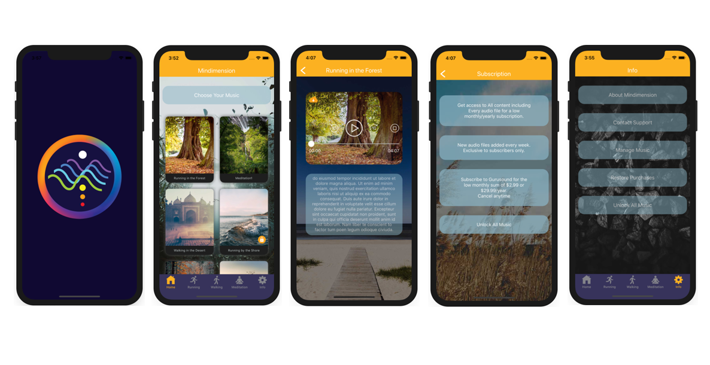

# MiniAudio
This is an app to play audio based on In-App purchase as like "Calm" and "Breethe"

---

## App Name
MiniAudio

---

## App background service

A Universal iOS Audio App built in Swift 5 with Xcode 10.3 that plays MP3 audio files when a button within a Tab view card is touched by the user. The music streams via an http file on a web server. The user should have the option of downloading the audio and storing the file on their iPhone/iPad.

---

## Skills

1. iOS, Swift5
2. AudioPlay
3. Https, Thread
4. In-App purchase

---

## ScreenShots

    

